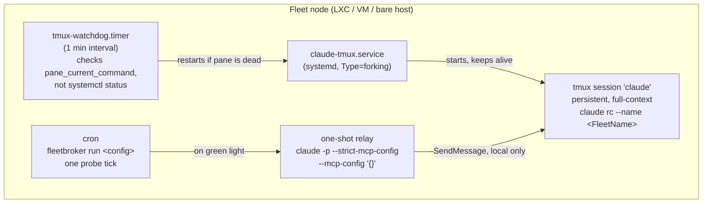
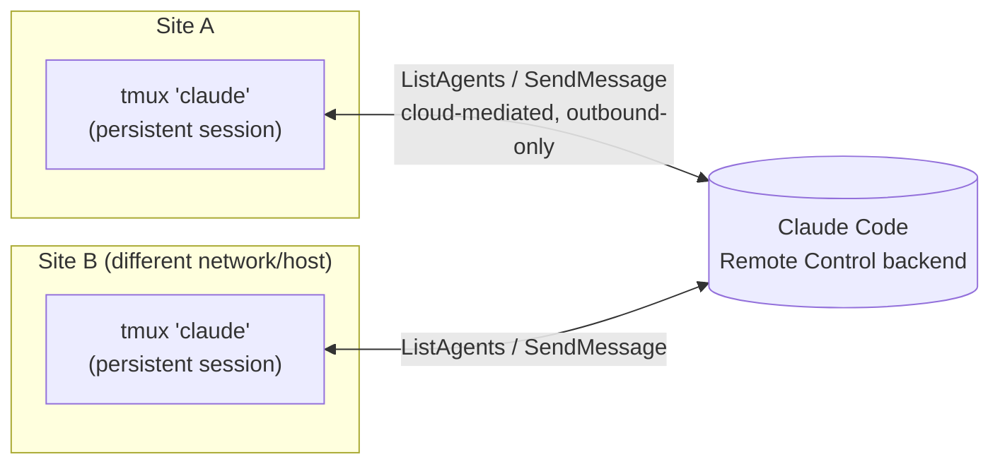

# Architecture: how a fleet actually runs

This ties together pieces documented separately elsewhere - the goal here is
the whole picture, not any one mechanism in isolation.

## A single node, internally

Every node (a Proxmox LXC, a bare VM, any Debian host) runs the same three
independent pieces, wired together by `provision/install-node.sh`:

The persistent tmux session is the only thing with real conversation
context. Everything else - cron, the one-shot relay - is disposable and
policy-free; it only ever hands a message to the one persistent session and
gets out of the way. See [`docs/incidents.md`](incidents.md) for why each of
these pieces exists (the MCP-spawn-storm crash, the trust-dialog restart
loop, the tmux-server environment race).

## Cross-node communication

Nodes never talk to each other directly - there is no custom transport in
this project, and none is needed:

`ListAgents`/`SendMessage` are a built-in Claude Code capability: each
node's Remote Control session holds an outbound-only connection to
Anthropic's backend, and discovery/messaging is relayed through it - no
shared network, VPN, or port-forwarding required, and it works across
independent sites. See [`docs/addressing.md`](addressing.md) for why a
relay targets a stable **tmux session name**, not the harness-generated
peer name, and [`docs/auth.md`](auth.md) for the one real provisioning
constraint this depends on (a node needs a full interactive login to be
discoverable this way).

## Personas: one identity per node, not one for the whole fleet

Nothing about a node's persona is fleetbroker's concern - it's Claude Code's
own per-instance configuration (`CLAUDE.md`, Skills, MCP servers), which
already differs node to node with zero fleetbroker involvement. What this
project adds is a repeatable way to *seed* that at provisioning time: an
optional `--profile <dir>` seeds a node's `CLAUDE.md`, copies Skills into
`~/.claude/skills/`, and registers MCP servers - see
[`provision/profiles/README.md`](../provision/profiles/README.md). A node
that plays a different role (say, one that only triages a specific set of
repos) can get a different persona and toolset without touching
fleetbroker's own code at all.

## Shared backlog: an external issue tracker as the synchronized state

For multi-site coordination beyond "here's spare quota, do something,"
[`fleetbroker.probes.gh_backlog`](../src/fleetbroker/probes/gh_backlog.py)
turns any Git-forge issue tracker (GitHub Issues is what's implemented;
GitLab/Gitea would follow the same shape) into the one shared,
independently-readable backlog. Labels carry priority/size/reservation, and
an assignee-style label is the claim - see
[`docs/backlog-fairness.md`](backlog-fairness.md) for the fairness algorithm
that stops one site from permanently outpacing another. No new database, no
cross-node sync layer: the issue tracker already is the synchronized store
both sites poll.

## Secrets: never fleetbroker's problem to solve, but a pattern that fits

A profile's `mcp.json` never contains a real secret value, only `${VAR}`
placeholders substituted from the installer's environment at install time
(see [`provision/profiles/README.md`](../provision/profiles/README.md)).
Where those environment variables come from is deliberately outside this
project's scope, but a self-hosted secrets manager (a password manager with
a scriptable CLI, or a dedicated secrets store) is a natural fit for
populating them without ever committing a real value anywhere - see
[`docs/secrets-management.md`](secrets-management.md) for the pattern.
